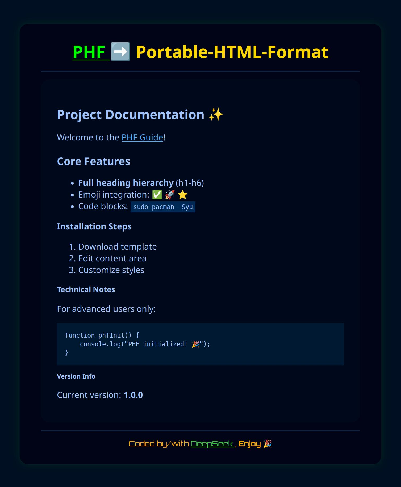

# PHF (portable-html-format)
### Preamble:
* HTML, like Markdown too, can be worked/written with every text editor on every operating-system.
Substantially, you get what you see, very transparent & without any hint.
* The only drawback in displaying such files... they are very plain, unadorned, often with garish background & Serif 
fonts. In the end, there is a lack of any personalization.
* Did you know that Markdown files can be easily and quickly converted to HTML by `ghostwriter` or `okular`?

### What is the goal of this work & what is it at all?
1. This HTML template is great for giving a personal touch to HTML files.
2. Open a Markdown file, export it to HTML, paste the HTML encoding into the dedicated section, that's it. & if you want 
to give it your own stamp... feel free & let off steam.
3. For beginners & professionals who want to try out HTML, the programming language of web-/home-pages. CSS (Cascading 
Style Sheets) is integrated, you don't need any extra CSS. A database is NOT included.

### What didn't work?
* There seems to be a problem with changing the color when a link has been visited, but everyone is invited to improve 
the code.

### Preview
* But, no more talking, you can see the following picture, which shows exactly what has been programmed in the HTML 
file:

✅  **Done** 👍 **& Enjoy**❗️
